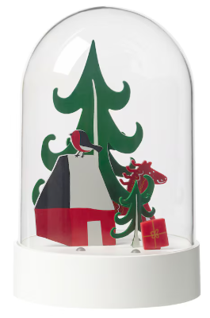
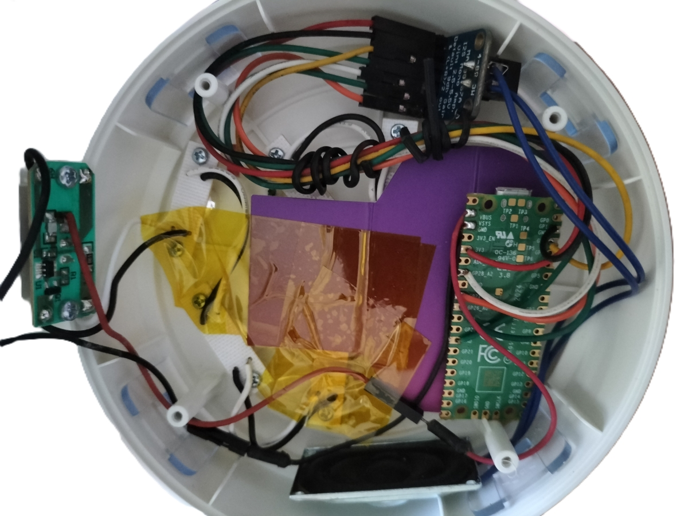

# ikea-strala-2023-music

This is a little music box modification for Ikea Strala LED table lamp (2023).

Basically, it is a simple Christmas theme table LED lamp. Nothing much to explain about here - however how about adding a little magic of some Christmas tunes inside? :D

## Requirements
- Raspberry Pico 2 (ARM cores selected, no RISC-V for now)
- Arduino 2.3.2 and above.
- ESP8266Audio library installed.
- MAX98357 module (obtainable from Adafruit or AliExpress).
- Triangular screwdriver (or Ikea Trixig) to open the bottom of that lamp.
- Small rectangular speaker (8 ohms, 2 watts) with dimension of 40x20x5.8mm. For reference you can check the RS online for this code "RS PRO 7564609".

## Connection to the MAX98357 module

MAX98357 | Pico 2 Pin |
| -------- | ------- |
LRC | 32
BCLK | 31
DIN | 34
SD | 28

## Connection to the power board

The lamp is powered by 3x Ikea Ladda batteries, and they are at total 3.6v. The Pico 2 module contains As mentioned in the [tutorial](https://randomnerdtutorials.com/power-raspberry-pi-pico-6-different-ways/#:~:text=For%20supplying%20power%20to%20the,cables%20to%20the%20battery%20pack.), connect the VSYS from the other end of the switch (see picture - left side, where the red cable goes to the VSYS). Pico 2's ground must be connected to the board's ground too.

Put some cardboard and some kapton tape to prevent the Pico 2, the MAX98357 module and the speaker from touching the screws at the bottom.

## Arduino sketch and MIDI songs

You must also need to set Flash Size in Arduino "**Sketch 3MB, Flash 1MB**". For simplicity purposes, there is a small soundfont file included (inside `/data/soundfont`) if you need to quickly test the MIDI player.

For Christmas songs, it is recommended to get simple Christmas piano midi files. To uploade these files you need the [uploader tool installed](https://github.com/earlephilhower/arduino-littlefs-upload). Files must be inside `/data` folder in the sketch folder.

## How it works

This sketch plays all the MIDI files in the flash. It stops and goes to standby mode when all the files are played. To restart it, switch the lamp off and then on.

## Current measurement during power on

- 17mA without the modification.
- 40-50mA with the modification and playing songs.
- around 17mA when the modification finished playing songs and in standby mode.

## Issues

- The music is a bit too soft - the speaker is inside the enclosed case and you may need to drill some holes around the speaker. Since I prefer to have the little table lamp in its original form, the modification is entirely optional and up to the user.
